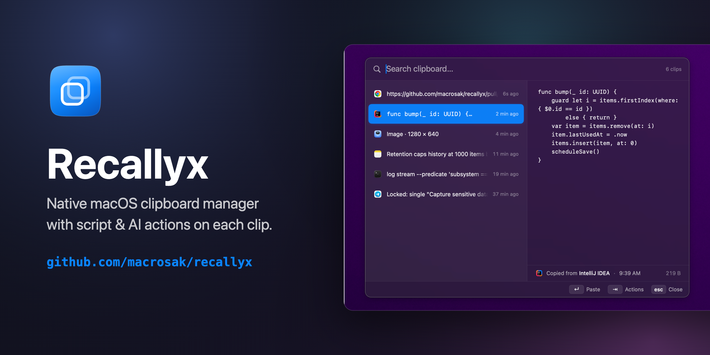
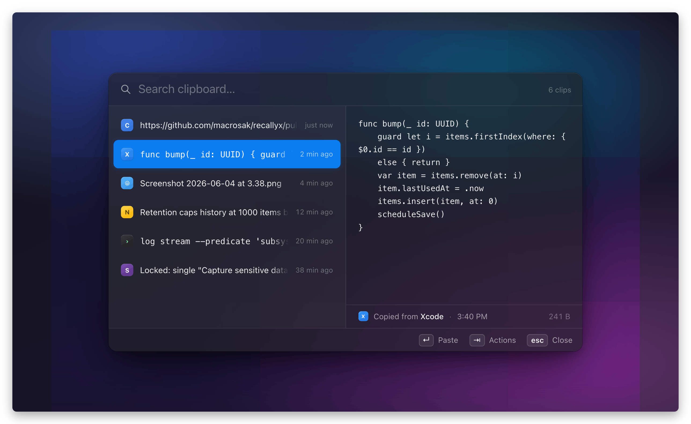
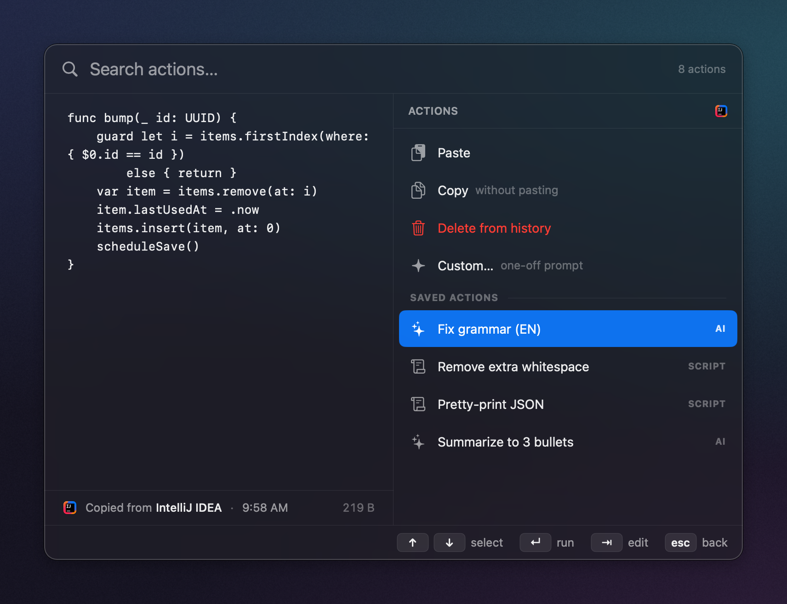

<div align="center">
  

  <h1>Recallyx</h1>
  <p><b>Native macOS clipboard manager with script &amp; AI actions on each clip.</b></p>

  <p>
    
    
    
    
  </p>
</div>

## What it is

Recallyx is a native macOS menu-bar clipboard manager. It watches the system clipboard and
keeps a searchable history of everything you copy — text and images — on disk. A fast
floating panel lets you find and paste anything from that history without leaving the app
you're in. On top of that sits an **actions** layer: small pipelines that transform a clip
before pasting it.

## The two hotkeys

- **⌘⇧V** — open the history panel. Fuzzy-search your clips, `↑/↓` to select, `↵` pastes the
  selected clip into wherever you were, `⇥` opens its action menu, `esc` closes.
- **⌃⇧V** — grab the current selection, push it to history, and open straight into its
  actions. Select text anywhere — including browsers like Chrome — transform it, paste the
  result in place.

Both are defaults, not fixtures: in **Settings → General → Shortcuts**, click a shortcut to
record a new combo (applied immediately, no relaunch) or **✕** to disable it. The menu-bar
items always show the current bindings.

## Screenshots

<p align="center">
  <br>
  <em>⌘⇧V — fuzzy-search your clipboard history.</em>
</p>

<p align="center">
  <br>
  <em>⇥ — run a script or AI action on the selected clip.</em>
</p>

## Actions

Press **⇥** on a clip to open its action menu. Built-in actions are Paste, Copy, and Delete
(images also get Copy file path / Reveal in Finder). Below those are your saved **actions**
and a **Custom…** entry:

- A **saved action** runs the clip's text through a pipeline of **script** (`bash` filter) and
  **AI** (OpenAI) steps and pastes the result. Steps are reorderable and individually toggled.
- **Custom…** lets you type a one-off instruction that runs once and is then discarded.
- **⇥ again** on a saved action lets you **edit its steps for just this run** (`⇥` paginates
  the steps, `⌘↵` runs) without changing the saved action.

Build and edit actions in **Settings → Actions**. AI steps need an OpenAI API key
(Settings → General; the key is stored in the macOS Keychain).

> **Privacy:** the **Capture sensitive data** toggle (Settings → General) is **off by
> default**, so Recallyx honors `org.nspasteboard.*` hints and skips password-manager and
> transient clips.

## Install

Requirements: **macOS 13 (Ventura) or newer** · **Apple Silicon (arm64)**.

Grab the latest DMG from the [**Releases** page](https://github.com/macrosak/recallyx/releases/latest),
open it, and drag **Recallyx.app** onto **Applications**.

Builds are currently **ad-hoc signed** (not yet notarized), so Gatekeeper blocks the first
launch with *"Apple could not verify Recallyx is free of malware."* Clear the quarantine
flag once, then open the app normally:

```bash
xattr -dr com.apple.quarantine /Applications/Recallyx.app
```

(On macOS 15 Sequoia and later, the old right-click → Open override no longer appears for
un-notarized apps, so the `xattr` command is the reliable way in.)

## Building from source

Needs Apple **Command Line Tools** (`xcode-select --install`) — Xcode itself is not required.

```bash
# one-time, per machine: a stable code-signing identity
./scripts/create-signing-identity.sh        # prints one `security add-trusted-cert …` to run yourself

# build + install (install.sh kills any running instance, then relaunches)
./scripts/bundle.sh && ./scripts/install.sh

# unit tests
./scripts/test.sh
```

The stable signing identity matters because ad-hoc signing produces a fresh signature on
every rebuild, which makes macOS drop the Accessibility grant each time; a self-signed
`Recallyx Dev` cert keeps the grant across rebuilds
([Apple's recommendation](https://developer.apple.com/forums/thread/730043)).

The clipboard history (⌘⇧V) works with no special permission. **⌃⇧V** (grab selection +
paste results) needs Accessibility: on first use the app shows an **Open Settings** alert →
toggle **Recallyx** on under **Privacy & Security → Accessibility** → **quit and relaunch**
(macOS reads the grant only at process start).

## Troubleshooting

- **A hotkey doesn't fire** — another app may have grabbed the combo globally
  (Alfred / Raycast / etc.); the status menu shows an error when that happens at launch.
  Rebind it in **Settings → General → Shortcuts**, or quit the other app.
- **"Accessibility permission missing" after granting it** — macOS is holding a stale
  requirement (usually from an earlier ad-hoc build). Reset and re-grant:
  ```bash
  tccutil reset Accessibility io.github.macrosak.recallyx
  killall Recallyx && ./scripts/install.sh
  ```
- **App blocked by Gatekeeper after replacing the bundle** — re-run the `xattr` command above
  on the new `Recallyx.app`.

## License

MIT — see [LICENSE](LICENSE).
